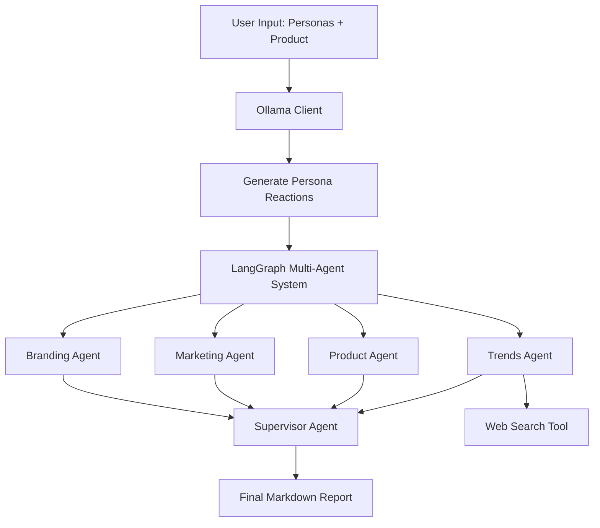

# Creative Agency AI Analyst

A **Streamlit application** that uses **LangGraph multi-agent system** to analyze products/brands from multiple customer personas perspectives using local **Ollama LLM** (deepseek-r1:14b).

## 🏗️ Architecture Overview



### Core Components

- **`app.py`** - Streamlit UI & entry point
- **`ollama_client.py`** - Local LLM communication with exponential backoff
- **`agents/graph.py`** - LangGraph workflow definition
- **`agents/prompts.py`** - System prompts for each agent role
- **`agents/tools.py`** - Web search tool for live market signals
- **`tests/`** -  PyTest

## 🤖 Multi-Agent System

### Specialist Agents

1. **🎨 Branding Agent** - Evaluates visual identity, positioning, tone-of-voice
2. **📈 Marketing Agent** - Proposes GTM strategy, pricing, campaigns  
3. **🛠️ Product Agent** - Identifies feature gaps and quick-win opportunities
4. **🌐 Trends Agent** - Fetches live social/news signals via DuckDuckGo
5. **👑 Supervisor Agent** - Synthesizes all insights into actionable report

### Workflow

1. User defines **N personas** + **product description**
2. **Ollama** generates synthetic reactions for each persona
3. **4 specialist agents** analyze in parallel from different perspectives
4. **Supervisor** creates unified markdown report with:
   - Executive Summary (≤120 words)
   - Persona-wise SWOT Analysis
   - Unified GTM & Pricing Strategy
   - Prioritized Action Items

## 🚀 Quick Start

### Prerequisites

- **Python 3.10**
- **Ollama** running locally with `deepseek-r1:14b` model
- **Anaconda** 

### Installation

1. **Clone & Setup Environment**
   ```bash
   git clone <repository-url>
   cd Creative-Agency
   conda create -n creative_agency python=3.10
   conda activate creative_agency
   ```

2. **Install Dependencies**
   ```bash
   pip install -r requirements.txt
   ```

3. **Configure Environment**
   ```bash
   cp .env.example .env
   # Edit .env if needed (default: http://localhost:11434)
   ```

4. **Start Ollama** (in separate terminal)
   ```bash
   # Install Ollama first: https://ollama.ai
   ollama pull deepseek-r1:14b
   ollama serve
   ```

5. **Run Application**
   ```bash
   streamlit run app.py
   ```

6. **Access Application**
   - Open browser to access application
   - Configure personas in sidebar
   - Enter product description
   - Click "🚀 Run Multi-Agent Analysis"

## 🧪 Testing

### Run Testing
```bash
# Run all tests
python -m pytest tests/ -v

# Run specific test files
python -m pytest tests/test_ollama_client.py -v
python -m pytest tests/test_graph.py -v  
python -m pytest tests/test_streamlit_inputs.py -v

# Run with coverage
python -m pytest tests/ --cov=. --cov-report=html
```

## 📋 Usage Guide

### 1. Persona Configuration
- Use sidebar to set number of personas (1-10)
- Describe each persona with:
  - Demographics & psychographics
  - Pain points & motivations
  - Buying behavior & preferences

### 2. Product/Brand Description
Include:
- Core features & benefits
- Target market positioning
- Value proposition
- Competitive landscape
- Brand personality

### 3. Analysis Results
- **📋 Final Report** - Comprehensive markdown analysis
- **🎭 Persona Reactions** - Individual LLM-generated responses
- **💾 Export** - Download as JSON, CSV, or Markdown

## 🔧 Configuration

### Environment Variables
```bash
# Required
OLLAMA_BASE_URL=http://localhost:11434    # Ollama server URL
OLLAMA_MODEL=deepseek-r1:14b             # LLM model name

# Optional
DUCKDUCKGO_MAX_RESULTS=10                # Web search results limit
DEBUG=True                               # Enable debug logging
```

### Customization

- **Add New Agents**: Extend `agents/graph.py` with new node functions
- **Modify Prompts**: Edit system prompts in `agents/prompts.py`
- **Enhance Tools**: Add new tools in `agents/tools.py`
- **UI Changes**: Customize Streamlit interface in `app.py`

## 🐛 Troubleshooting

### Common Issues

1. **"Ollama connection failed"**
   - Ensure Ollama is running: `ollama serve`
   - Check model availability: `ollama list`
   - Verify URL in `.env` file

2. **"No module named 'agents'"**
   - Run from project root directory
   - Ensure Python path includes current directory

3. **Web search timeouts**
   - Check internet connection
   - DuckDuckGo rate limiting (retry after delay)

4. **Memory issues with large models**
   - Use smaller model: `ollama pull llama2:7b`
   - Update `OLLAMA_MODEL` in `.env`

## 🔄 Development

### Adding New Features

1. **Write Tests First** - Add tests in `tests/`
2. **Implement Feature** - Add code to appropriate module
3. **Run Tests** - Ensure `pytest -q` passes
4. **Update Documentation** - Modify README and docstrings

### Code Quality

- **Type Annotations** - Python 3.11+ type hints
- **Flake8 Compliance** - Clean, readable code
- **Google Docstrings** - Comprehensive documentation
- **Test Coverage** - Aim for >90% coverage

## 📦 Dependencies

### Core Framework
- `streamlit>=1.33.0` - Web interface
- `langgraph>=0.1.8` - Multi-agent orchestration
- `requests>=2.31.0` - HTTP client for Ollama

### AI & Search
- `langchain>=0.1.0` - LLM abstractions
- `duckduckgo-search>=5.0.0` - Web search tool

### Development
- `pytest>=7.4.0` - Testing framework
- `python-dotenv>=1.0.0` - Environment management

## 🤝 Contributing

1. Fork the repository
2. Create feature branch: `git checkout -b feature/amazing-feature`
3. Add tests for new functionality
4. Ensure all tests pass: `pytest tests/`
5. Commit changes: `git commit -m 'Add amazing feature'`
6. Push to branch: `git push origin feature/amazing-feature`
7. Create Pull Request

## 📄 License

This project is licensed under the MIT License - see LICENSE file for details.

## 🙏 Acknowledgments

- **LangGraph** - Multi-agent workflow orchestration
- **Streamlit** - Rapid web app development
- **Ollama** - Local LLM inference
- **DuckDuckGo** - Privacy-focused web search

---

**Built with ❤️ for creative agencies and product teams** 